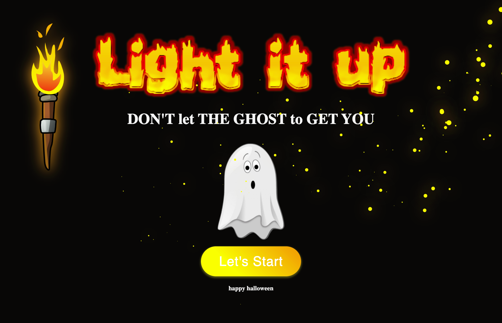
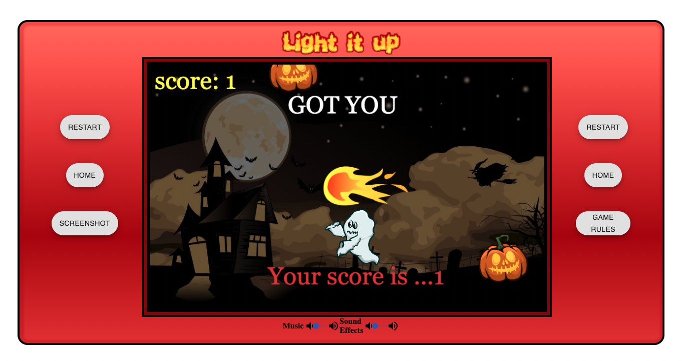
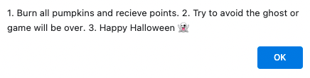
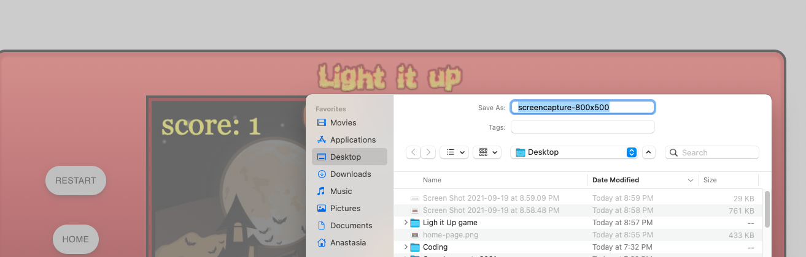

# light-it-up

 

  ## Table of contents
 * [Description](#GDescription)
 * [Specifics](#Specifics)
 * [Deployment of application](#Deployment-of-application)
 * [Application Code](#Application-Code)
 * [Screenshots](#Screenshots)
 * [Future Developments](#Future-Developments)

# Description

 Light it up is Halloween themed game application. User (as a light in the game) can collect points by trying to reach moving pumpkins. Every pumpkin is equivalent to one point. However, if the user touches the ghost, the game will be over.

# Specifics

  When the user opens the game:
   * Home page:
    * Logo designed specifically for the game using photoshop
    * Warning for the user, that specifies the main rule of the game. “Don’t let the ghost to get you”
    * Image of the ghost
    * Start button:
        After pressing “Let’s start” button user will be relocated directly to the Game page, where the game will automatically start
    * Happy Halloween wishes
    * Animated torch that was created with Canvas and Vanilla JavaScript
    * When user navigates the mouse, the particles appear creating magical light/fire effect. Particles were created using Vanilla JavaScript and Canvas

   * Game page:
      The page designed to look like a gaming console. When game starts, user will hear background Halloween music. The user will have an option continue with the game, restart the game, switch back to home page or even take a screenshot of the game. 

     * The Game:
        Game was created using Canvas and Vanilla JavaScript. User controls the light by clicking the mouse at any spot on the game screen. If the light hits a pumpkin, the pumpkin will disappear (burn), with a fire burning sound and the user will receive 1 point. On the left corner of the screen, the user can see the current score. Animated ghost will appear randomly in the game. If the user collides with the ghost the game will be over. The user will hear a witch’s laugh, background music will stop, and warning “Got you”. The current scores will be shown on the screen.

      * Buttons:
         * Restart: If user clicks on restart button the page will reload and the game will automatically start over  
         * Home: After clicking on home button user will be relocated back to home page
         * Screenshot: User can make game screenshot by pressing screenshot button. After clicking the button user will be presented with the option to download the image to the local computer.

# Deployment of application

   To run a project, please follow the link  [https://light-it-up-game.herokuapp.com/](https://light-it-up-game.herokuapp.com/)

# Application Code

   To view application code, please follow the link [https://github.com/sheymanidze/light-it-up](https://github.com/sheymanidze/light-it-up)

# Screenshots

 * Home page 

* Game page

* Game rules button/alert

* Screenshot button in action

# Future Developments
  
 * New levels:
   After reaching certain number of points new level of the game will start with new background, more obstacles to avoid, and new aims to collect points.

 * Storage:
   Create local storage to store and display scores

 * New buttons:
   Instead of repeating home and restart buttons new buttons can be created. View scores, top players, etc.

 * Volume buttons:
   User would be able to adjust background music and sound effects volume

 * More games: 
   More games will be created using canvas. User will be able to choose the game from the home page

 * Sign in/sign up page:
   After sign in user can view game played and scores for each game. Also, based on the previous games, user will have games recommendations. 
